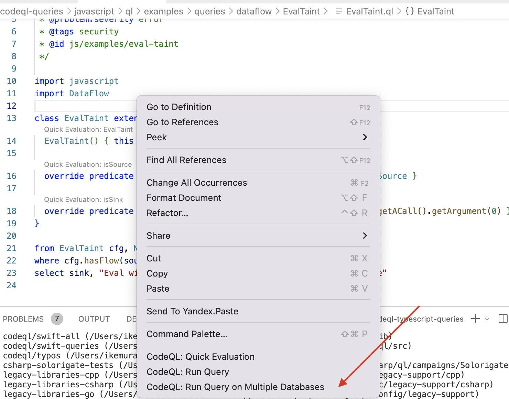

# HTTP Smuggling

## About

Атака, при которой фронт (front-end proxy, HTTP-enabled firewall или цепочка серверов с различной конфигурацией) воспринимает запрос как один (например, он открывает сокет с бэкенд сервером и в рамках одного сокета шлет запросы пользователей), а на бэке он распадается на два (бэкенд по специальным заголовкам понимает, где конец одного запроса и начало следующего).



Делается это с помощью заголовков **Content-Length (CL)** или **Transfer-Encoding (TE)**.

## Как это происходит?

Спецификация HTTP позволяет указать серверу, что запрос завершен, двумя способами. Использовать **Content-Length** или **Transfer-Encoding: chunked**.

**Content-Length** указывает сколько байтов тело запроса. Тогда как **Transfer-Encodiing: chunked** указывает, что тело запроса будет отправлено кусками, разделенными последовательностями новой строки, причем каждому фрагменту предшествует его размер в байтах (hexadecimal). Тело запроса заканчивается фрагментом нулевой длины.

Спецификация HTTP указывает, что при наличии CL и TE заголовков, **CL следует игнорировать**. Однако, по разным причинам при отправке обоих этих заголовков в одном запросе может возникнуть конфликты:

* Некоторые HTTP сервера не поддерживают TE заголовок
* Другие могут его игнорировать при использовании некоторых кодирований/обфускации

### Другой пример

Использование двух Content-Length - где-то может взяться первый content-length, а на другом серваке - второй

```
POST / HTTP/1.1
Host: example.com
Content-Length: 6
Content-Length: 5

12345GPOST / HTTP/1.1
Host: example.com
…
```

Тогда с первого вернется: UNKNOWN HTTP Method GPOST (как детект)

Подробнее: [https://portswigger.net/research/http-desync-attacks-request-smuggling-reborn](https://portswigger.net/research/http-desync-attacks-request-smuggling-reborn)

### Еще трюк

I found another way to do HTTP smuggling, you can use T-E: chunKed\
K is the Kelvin symbol (%E2%84%AA) If the header is converted to lowercase, you get 'chunked' in ascii, if it's converted to uppercase it will stay the same (invalid)

## Как детектировать

Smuggler extension for Burp: [https://kalilinuxtutorials.com/http-request-smuggler-extension-burp-suite/](https://kalilinuxtutorials.com/http-request-smuggler-extension-burp-suite/)

Python script: [https://github.com/gwen001/pentest-tools/blob/master/smuggler.py](https://github.com/gwen001/pentest-tools/blob/master/smuggler.py)

## TODO

Сделать лабу на HTTP Smuggling

## Mitigation

* Убедитесь, что одно и то же серверное программное обеспечение используется как на внешнем, так и на внутреннем серверах, чтобы они синхронизировались, какой заголовок они будут использовать, чтобы предотвратить конфликты (либо **Content-Length**, либо **Transfer Encoding: chunked**).&#x20;
* Некоторые провайдеры WAF уже имеют встроенные средства защиты при обнаружении аномальных запросов. Уточните у своего провайдера, есть ли у него поддержка для этого.&#x20;
* Отключите повторное использование внутренних соединений, чтобы каждый внутренний запрос отправлялся через отдельное сетевое соединение.

## Papers

Статьи: \
[https://habr.com/ru/post/468489/](https://habr.com/ru/post/468489/)\
[https://blog.deteact.com/gunicorn-http-request-smuggling/](https://blog.deteact.com/gunicorn-http-request-smuggling/)\
[https://portswigger.net/web-security/request-smuggling](https://portswigger.net/web-security/request-smuggling)\
[https://www.rcesecurity.com/2020/11/Smuggling-an-un-exploitable-xss/](https://www.rcesecurity.com/2020/11/Smuggling-an-un-exploitable-xss/)

## Labs

HTTP Smuggling lab: здесь внутри и на сокетах и в разных конфигурациях и тп [https://github.com/ZeddYu/HTTP-Smuggling-Lab](https://github.com/ZeddYu/HTTP-Smuggling-Lab)

И норм материал к этому: [https://regilero.github.io/english/security/2019/10/17/security\_apache\_traffic\_server\_http\_smuggling/](https://regilero.github.io/english/security/2019/10/17/security\_apache\_traffic\_server\_http\_smuggling/)

